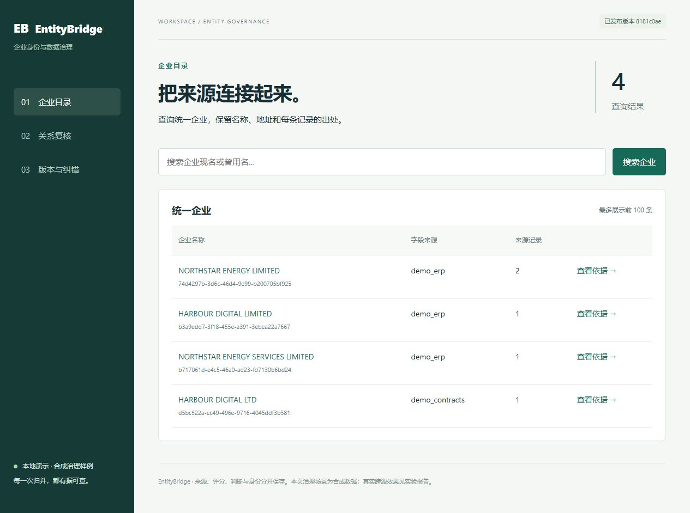
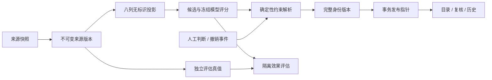

# EntityBridge

**企业实体关联与可撤销身份治理工作台。** 将不同来源的企业记录关联成统一身份，并保留原始记录、匹配依据、人工判断和历史去向。

同一家公司在两个系统中可能有不同名称；同一地址上的两家公司也可能是不同法人。EntityBridge 处理这类匹配，以及匹配之后的纠错：**为什么合并、谁确认过、撤销影响哪些记录、旧企业 ID 现在去了哪里。**

项目采用 Python、Splink、DuckDB/Parquet、SQLAlchemy、PostgreSQL、FastAPI 和 Jinja2，面向数据工程、数据质量与 Python 后端的工程展示。它是可运行的单机研究原型，尚未接入真实采购或 CRM 业务。

[快速运行](#快速运行) · [实际结果](#实际结果) · [架构](#逻辑结构) · [复现](#测试与实验复现) · [成熟度与岗位定位](docs/review/MATURITY_AND_POSITIONING.md)



## 已实现的工作流

1. **导入与保留版本**：对来源数据做字段校验和规范化，保留不可变记录版本；重复导入与来源更新有明确语义。
2. **生成候选与证据**：可信登记号匹配和无标识文本匹配分开；后者比较精确名称、模糊名称与冻结的 Splink 模型。
3. **约束归并**：独立 resolver 综合模型边与人工同一/不同判断；“不同企业”约束作用于整个簇，不能通过第三条记录绕过。
4. **复核与撤销**：人工确认、拒绝或暂缓；撤销前预览影响，保留理由和依据版本。撤销一项支持不保证一定拆簇。
5. **发布与追溯**：候选身份版本完整落盘后才切换当前指针；过期操作拒绝提交。旧版本可查询，旧 ID 展示合并或拆分后的全部去向。
6. **更新与重算**：固定候选策略下，在旧、新支持图的受影响闭包内重算；超过预算或策略变化时按相同语义全量兜底。

界面包含企业目录、关系复核和版本历史，目录与复核按每页 100 条展示，支持翻页及按复核状态筛选，翻页链接固定所依据的版本。分支机构、继承关系保留为来源关系，不直接推出同一法人。数据库初始化运行版本迁移；SQLite 用于快速演示，PostgreSQL 用于持久化与专项验证。

## 快速运行

需要 **Python 3.12**。在仓库根目录执行；无需下载真实数据、配置账号或运行 PostgreSQL。

Windows PowerShell：

```powershell
py -3.12 -m venv .venv
.\.venv\Scripts\python.exe -m pip install -r requirements.lock
.\.venv\Scripts\python.exe -m pip install -e . --no-deps
.\.venv\Scripts\python.exe -m entitybridge.cli demo
```

Linux/macOS 对应命令：

```bash
python3.12 -m venv .venv
.venv/bin/python -m pip install -r requirements.lock
.venv/bin/python -m pip install -e . --no-deps
.venv/bin/python -m entitybridge.cli demo
```

打开 [http://127.0.0.1:8000](http://127.0.0.1:8000)，按 `Ctrl+C` 停止。端口占用时加 `--port 8001`。默认状态保存在 `artifacts/demo.sqlite`，重新启动保留操作历史；若设置了 `DATABASE_URL`，程序使用该数据库。

演示中的公司、地址与初始评分均为**合成治理案例**，用于展示错误合并、人工纠正和撤销；页面中的手设分数不是模型实测成绩。`demo` 只监听本机并授予演示管理权限。真实数据评测与合成演示分开，见下文。

已有环境时只需最后一条启动命令。实测基准环境为 Windows、Python 3.12.13、Splink 4.0.17、DuckDB 1.5.5；依赖版本见 [requirements.lock](requirements.lock)。CI 定义包含 Windows/Linux，实际执行状态以仓库 Actions 为准，不将配置文件等同于跨平台验证结果。

[五分钟字幕导览](docs/demo/EntityBridge-5min.mp4) · [演示操作脚本](docs/demo/WALKTHROUGH.md)。视频由实际浏览器截图和字幕组成，无音轨，不是一镜到底录屏。

## 实际结果

主实验来自 **GLEIF Golden Copy 与 Companies House 官方数据**。最终固定发布集有 **94,104 条来源记录**；训练 59,764 条、验证 20,000 条、测试 14,340 条，对应测试企业 7,170 个。阈值只由验证集选定。原先看过的开发测试企业全部排除，最终 test 使用同一快照中剩余的企业，不是时间外推。

| 方法 | 测试 Precision | Recall | F1 |
|---|---:|---:|---:|
| 精确名称 | 1.0000 | 0.9905 | **0.9952** |
| 模糊名称，验证阈值为 1.0 | 1.0000 | 0.9905 | 0.9952 |
| 当前 Splink 配置 | 1.0000 | 0.8866 | **0.9399** |

**当前 Splink 配置弱于精确名称基线。** 两个公开来源的现名称大多一致，且可能依赖同一登记机关。这里观测到零误配不等于真实业务零风险；不能据此声称算法领先或跨国泛化。

主实验候选召回为 99.80%，全量产生 846,212 对候选；单次离线实验约 46.46 秒、进程峰值内存约 3.96 GB。另完成真实 10k 记录的 PostgreSQL/API 整合验收。离线计算规模、数据库整合与线上吞吐是不同测量，本项目没有生产 SLA。[完整结果与口径](docs/evaluation/RESULTS.md) · [主实验数值证据](docs/evaluation/evidence/release_final_v2_report.json)

v0.2.0 修复后重新完成 10k PostgreSQL 整合验收，7 项完整性检查通过，临时 schema 已清理；总计约 15.70 秒，其中通过分页读取全部企业约 1.57 秒。分页限制单次响应大小，没有证明查询提速。[本轮整合报告](docs/evaluation/evidence/real_workflow_10k_v02.json)

### 曾用名的候选召回探索

只有曾用名且缺少地址时，原候选覆盖很弱。新增可选的冻结字符 n-gram TF-IDF 检索，在一个**已看过的探索性测试集**上，将候选召回从 **19.51% 提高到 46.06%**，同时候选对由 539 增至 18,481。它找到了更多可能配对，但自动模糊匹配 F1 从 **30.61% 降至 19.62%**，当前 Splink 仍未接纳配对。

这项增强用于复核候选探索，不能当成自动匹配质量提升，也没有替换默认匹配策略。服务中的 hybrid 模式不自动归并评分边，必须经人工明确接受；真实评分仍保留为复核证据。全局 top-k 的邻居可能因其他记录变化而改变，因此每次必须重新生成全量候选，不沿用固定桶的局部重算承诺。[匹配审查与复现](docs/review/MATCHING_AUDIT.md) · [探索性数值证据](docs/evaluation/evidence/hybrid_name_v2_summary.json)

## 逻辑结构



模型给出证据，resolver 决定分区，存储层维护历史与当前可见版本。可信登记号入口 `POST /registry-runs` 独立于 `POST /match-runs`：编号、LEI、URL、真实企业分组和嵌入文本的标识不能进入无标识匹配器。模型与训练 TF 保存后冻结；来源版本或策略变化必须显式进入运行依据。

| 模块 | 职责 |
|---|---|
| `ingestion.py`、`normalization.py` | 来源解析、版本契约、无标识特征投影 |
| `candidates.py`、`matching.py`、`evaluation.py` | 候选、第三方模型/基线、效果与完整性评估 |
| `resolution.py`、`identity.py`、`incremental.py` | 簇级约束、身份去向、受影响图重算 |
| `store.py`、`schema.py`、`database.py` | 来源版本、判断事件、迁移与事务发布 |
| `api.py`、`web/` | HTTP 接口、权限和三页界面 |

项目实现的是这些模块之间的数据与治理契约；Splink 的概率关联/EM、DuckDB 的查询执行和第三方相似度算法不属于自研算法。[匹配设计](docs/decisions/001-matching.md) · [评测设计](docs/decisions/002-evaluation.md) · [身份](docs/decisions/004-identity.md) · [撤销](docs/decisions/005-revocation.md) · [增量](docs/decisions/006-incremental.md)

## 测试与实验复现

常规测试使用合成夹具和临时数据库，不下载数据，也不要求 PostgreSQL：

```powershell
.\.venv\Scripts\python.exe -m pytest -q -m "not postgres and not network"
.\.venv\Scripts\python.exe -m ruff check src scripts tests migrations
.\.venv\Scripts\python.exe scripts\check_compatibility.py
```

测试覆盖来源更新、约束冲突、撤销、旧 ID、过期/并发操作、不可变模型、增量/全量等价、独立图参考和进程终止恢复。本轮审查还修复了历史数据重导入、撤销并发、空文本列评分及外部候选无法被评分等问题；这不代表不存在其他 bug。[存储审查](docs/review/STORE_AUDIT.md) · [匹配审查](docs/review/MATCHING_AUDIT.md) · [安全与接口边界](docs/review/SECURITY_AND_API.md)

真实数据流程使用新的输出目录，保留旧快照和结果：

```powershell
.\.venv\Scripts\python.exe scripts\fetch_public_data.py --raw-dir artifacts/raw/reproduced --ch-date 2026-09-01 --ch-parts 7 --gleif-pages 0 --golden-copy
.\.venv\Scripts\python.exe scripts\build_benchmark.py --raw-dir artifacts/raw/reproduced --output-dir artifacts/datasets/reproduced --sizes 10000 100000
.\.venv\Scripts\python.exe scripts\run_experiment.py --dataset artifacts/datasets/reproduced/real_10000 --output artifacts/reports/reproduced_10k
```

完整来源下载约 1 GB，还需为数据、模型和实验产物预留空间；下载脚本要求至少 4 GiB 可用。Golden Copy 使用下载时的最新发布，CH 历史文件也可能轮换。新日期的数据是新实验；要重放原实验输入，需要相同快照及 manifest 哈希，不能保证未来下载逐字节相同。

构建器按实体切分，matcher 只接收八列允许字段；实验在训练前验证文件哈希、实体互斥和记录覆盖。输出包含冻结配置、模型/TF、验证曲线、候选及端到端指标、错误分解、簇指标与资源用量。新执行结果应写入新目录，不覆盖封存证据。

主实验 94,104 条发布集与曾用名条件的构造步骤见 [重新封存说明](docs/data/V4_RELEASE_HOLDOUT.md)、[数据契约](docs/data/SOURCES_AND_CONTRACT.md)和[审计结果](docs/data/data_audit.md)。原始数据、真值记录与大型模型产物不随仓库发布；公开数值见 [证据 SHA-256 清单](docs/evaluation/evidence/SHA256.json)。

### 可选 PostgreSQL

已有 PostgreSQL 时设置 `DATABASE_URL`；[compose.yaml](compose.yaml) 提供数据库配置示例。`serve` 使用配置的管理、复核或只读令牌，配置格式见 [.env.example](.env.example)，命令行不会自动加载该文件。

Windows 也提供项目内 PostgreSQL 启停及隔离测试脚本；所需官方二进制、中文路径处理和专项命令见[数据库说明](docs/decisions/003-postgres.md)。默认合成测试与 PostgreSQL 专项分开，未启用的专项明确跳过。

## 适用范围与当前差距

项目的主要价值是**数据对齐后的可追溯纠错和可核验工程过程**，适合展示数据契约、评估隔离、事务边界与失败恢复。与成熟方案的官方能力比较、岗位定位和可核验描述见[成熟度审查](docs/review/MATURITY_AND_POSITIONING.md)。

- 数据是能通过登记号交叉验证的闭集，两源可能同源；没有真实双人标注、跨时间业务验证或人工节省工时实验。
- 模型概率未校准；曾用名且缺地址时信息不足。扩大召回会增加误候选，需要独立标注和更可靠的评分策略。
- 当前查询仍读取完整版本文件，固定策略增量也会扫描记录找桶；没有分布式执行、生产容量或长期稳定性承诺。
- 权限是**本机、单工作空间的 token 角色隔离**：viewer 读取已发布目录，reviewer 复核/撤销，admin 导入/评分/发布。它不包含企业 SSO、多租户隔离或完整互联网认证体系。
- 没有实际采购收益、生产部署或客户使用成绩；不会把候选召回改善表述为自动质量改善。

公开源码由严格白名单导出，排除内部规划、运行数据库、原始数据、凭据和旧工作区历史；`PUBLICATION_MANIFEST.json` 记录导出文件摘要。CI 检查合成测试、静态规则、发布边界及 wheel 中的 HTML/CSS 资源。

项目自身尚未选择发布许可证，没有代作者添加 `LICENSE`；第三方和数据条款见 [THIRD_PARTY_NOTICES.md](THIRD_PARTY_NOTICES.md)。公开可阅读的源码不应被表述为已采用某项开源许可证。
