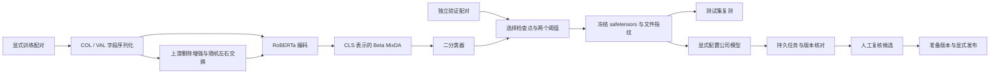

# ADR 014：采用 Ditto 的神经匹配组件

日期：2026-09-13。

## 问题与取舍

WDC Products 的困难商品配对暴露了字符串与固定特征逻辑回归的能力限制。项目采用公开、可复现的强匹配方法，保留上游算法归属，将工程工作放在数据隔离、训练复现、版本约束和业务接入上。

选择 [Megagon Labs 的 Ditto](https://github.com/megagonlabs/ditto)，论文为 [Deep Entity Matching with Pre-Trained Language Models](https://arxiv.org/abs/2004.00584)。它是成熟的 Transformer 实体匹配方案，本项目不把它称为 2026 年所有任务的最佳算法。RoBERTa 与 MixDA、删除增强来自该路线；与最新论文的正式排名仍需要相同数据划分、字段、算力和调参预算。

上游冻结在 `52985564a93fb11308439516d3e17a033d43ec8f`。完整 Apache-2.0 许可证随 vendored 代码和 wheel 保留，原文件 SHA256 及修改说明见 [来源清单](../data/DITTO_UPSTREAM.json)。没有使用上游每轮读取测试集的训练循环。

## 数据流

商品模型只接收 title、brand、description、price、priceCurrency；公司模型只接收 name、address、city、postcode、country。编号负责找回配对端点，不作为输入字段。标签、真实产品分组和来源审计信息被拒绝进入模型特征。

序列化转义增强器的保留字，提供正确的 padding attention mask。上游删除增强中的标签切片笔误得到修正。训练保留 CLS + Beta MixDA + 线性分类器的核心机制，使用 PyTorch AdamW、梯度累积、梯度检查点和可选 bf16；推理统一 float32。推理按照排序后的记录 ID 确定左右顺序，没有承诺交换文本顺序后的分数完全相同。

## 训练与评估约束

训练接口只有训练集和验证集参数。所有样本必须有显式二元标签，两份数据的记录不能重叠；商品的产品级隔离由 WDC 适配器核查，审核数据的共享端点与标签闭包由既有数据验证器核查。

检查点按验证集 F1 选择，同分保留较早轮次。所有比较方法都分别选取验证集最大 F1 阈值及最小 `10FP + FN` 阈值；同分优先较高阈值或拒绝全部。成本阈值是同一个 F1 检查点上的次要诊断，并非单独按成本选择神经检查点。

本轮 WDC 早前已经评分，必须标为 `exploratory-replayed`。继续采用移除训练产品重叠后的验证集，测试集保持原样。模型、训练方案、代码副本与两套阈值在测试特征读取前落盘。测试依赖图只有一个连通分量时不生成虚假的独立 bootstrap 区间。商品配对分数不证明公司匹配泛化，也不测量候选召回。

## 服务接入

`method=ditto` 接入现有同步匹配和持久任务。API 与 CLI Worker 使用管理员明确配置的公司模型路径。模型目录包含 safetensors、RoBERTa 配置、tokenizer 和登记各文件 SHA256 的 manifest；加载只访问本地，不加载 pickle、远程自定义代码或隐式下载。提交任务时冻结模型指纹，执行前及实际加载后核对，源代码指纹也包含 Ditto 推理代码。

商品模型不能进入公司匹配任务。当前神经分数未经部署校准，评分边统一为人工复核候选；即使分数超过阈值，仍需明确接受判断。准备版本、任务完成与发布是不同的业务状态。模型轮换会改变策略依据，旧判断按现有版本规则处理。

神经任务每次全量重新评分候选，服务推理固定 CPU，避免把不同批次或设备的小数差异包装为与增量全量绝对一致的保证。当前没有服务模型常驻缓存、批处理推理服务器或 GPU 多租户调度；请求量增加时需要单独测量和改造。公司模型可由 `train-review-ditto` 从已发布的人工标签导出物训练，标签数量不足则明确拒绝。

## 验证范围

合成测试覆盖字段隔离、保留字、重复/无效配对、文件篡改、版本域校验、验证集阈值、上游删除增强、真实小型 RoBERTa 训练、保存重载、padding 批次一致性、公司审核数据训练和真实队列准备/发布流程。CI 使用离线合成小模型，不下载真实训练数据，不把合成夹具结果当作算法效果。

真实 WDC 训练与结果另存独立报告。只有完成的测试、实际测得的指标可以写入发布说明或求职材料。
